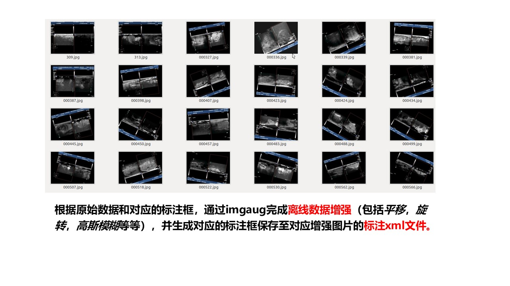
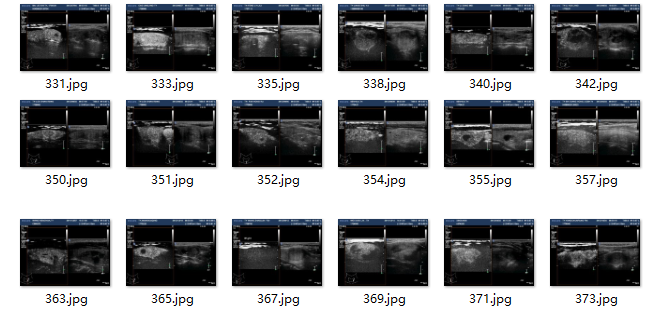

# 【ROI定位】对超声影像上影像及目标框进行增强
### 依赖包：

`pip install matplotlib` \
`pip install opencv-python` \
`pip install imageio`\
`pip install scipy`\
`pip install imgaug`
----
## 简介

<div align="center">
  
</div>

⭐ 1.利用imgaug对影像增强的同时，对keypoint, bounding box进行相应的变换。\
⭐ 2.在多模态超声感兴趣区域定位的过程中，训练集包括影像及其对应的bounding box文件，在对影像增强的时候，同时解算出bounding box 相应变换的坐标生成对应的bounding box文件。

参考代码链接：[GitHub](https://github.com/mickkky/XML-Augment.git)

----
# 使用示例

## 数据准备

输入数据为两个文件夹一个是需要增强的影像数据（JPEGImages），一个是对应的xml文件（Annotations）。 \
**注意：影像文件名需和xml文件名相对应**

| JPEGImages 图像数据                              | Annotations xml标注文件                         |
|----------------------------------------------|---------------------------------------------|
|  |  |

## 设置文件路径

```python
IMG_DIR = "../create-pascal-voc-dataset/examples/VOC2007/JPEGImages" # 原始图像数据位置
XML_DIR = "../create-pascal-voc-dataset/examples/VOC2007/Annotations" # 原始标注xml文件位置

AUG_XML_DIR = "./Annotations"  # 存储增强后的XML文件夹路径
try:
    shutil.rmtree(AUG_XML_DIR)
except FileNotFoundError as e:
    a = 1
mkdir(AUG_XML_DIR)

AUG_IMG_DIR = "./JPEGImages"  # 存储增强后的影像文件夹路径
try:
    shutil.rmtree(AUG_IMG_DIR)
except FileNotFoundError as e:
    a = 1
mkdir(AUG_IMG_DIR)
```


## 设置增强次数

```python
    AUGLOOP = 10 # 每张影像增强的数量
```

## 设置增强参数

通过修改Sequential函数参数进行设置，具体设置参考[imgaug使用文档](https://imgaug.readthedocs.io/en/latest/index.html)

```python
seq = iaa.Sequential([
    iaa.Flipud(0.5),  # v翻转
    iaa.Fliplr(0.5),  # 镜像
    iaa.Multiply((1.2, 1.5)),  # 改变明亮度
    iaa.GaussianBlur(sigma=(0, 3.0)),  # 高斯噪声
    iaa.Affine(
        translate_px={"x": 15, "y": 15},
        scale=(0.8, 0.95),
        rotate=(-30, 30)
    )  # translate by 40/60px on x/y axis, and scale to 50-70%, affects BBs
])
```


------
# 代码实现

### 读取原影像bounding boxes坐标

读取xml文件并使用ElementTree对xml文件进行解析，找到每个甲状腺目标的坐标值[xmin,ymin,xmax,ymax]。

```python
def change_xml_annotation(root, image_id, new_target):
    new_xmin = new_target[0]
    new_ymin = new_target[1]
    new_xmax = new_target[2]
    new_ymax = new_target[3]

    in_file = open(os.path.join(root, str(image_id) + '.xml'))  # 这里root分别由两个意思
    tree = ET.parse(in_file)
    xmlroot = tree.getroot()
    object = xmlroot.find('object')
    bndbox = object.find('bndbox')
    xmin = bndbox.find('xmin')
    xmin.text = str(new_xmin)
    ymin = bndbox.find('ymin')
    ymin.text = str(new_ymin)
    xmax = bndbox.find('xmax')
    xmax.text = str(new_xmax)
    ymax = bndbox.find('ymax')
    ymax.text = str(new_ymax)
    tree.write(os.path.join(root, str("%06d" % (str(id) + '.xml'))))
```

### 生成变换序列

产生一个处理图片的Sequential。

```python
# 影像增强
seq = iaa.Sequential([
    iaa.Flipud(0.5),  # vertically flip 20% of all images
    iaa.Fliplr(0.5),  # 镜像
    iaa.Multiply((1.2, 1.5)),  # change brightness, doesn't affect BBs
    iaa.GaussianBlur(sigma=(0, 3.0)),  # iaa.GaussianBlur(0.5),
    iaa.Affine(
        translate_px={"x": 15, "y": 15},
        scale=(0.8, 0.95),
        rotate=(-30, 30)
    )  # translate by 40/60px on x/y axis, and scale to 50-70%, affects BBs
])
```

### bounding box 变化后坐标计算

先读取该影像对应xml文件，获取所有目标的bounding boxes，然后依次计算每个box变化后的坐标。

```python
seq_det = seq.to_deterministic()  # 保持坐标和图像同步改变，而不是随机
# 读取图片
img = Image.open(os.path.join(IMG_DIR, name[:-4] + '.jpg'))
# sp = img.size
img = np.asarray(img)
# bndbox 坐标增强
for i in range(len(bndbox)):
    bbs = ia.BoundingBoxesOnImage([
        ia.BoundingBox(x1=bndbox[i][0], y1=bndbox[i][1], x2=bndbox[i][2], y2=bndbox[i][3]),
    ], shape=img.shape)

    bbs_aug = seq_det.augment_bounding_boxes([bbs])[0]
    boxes_img_aug_list.append(bbs_aug)

    # 此处运用了一个max，一个min （max是为了方式变化后的box小于1，min是为了防止变化后的box的坐标超出图片，在做faster r-cnn训练的时候，box的坐标会减1，若坐标小于1,就会报错，当然超出图像范围也会报错）
    n_x1 = int(max(1, min(img.shape[1], bbs_aug.bounding_boxes[0].x1)))
    n_y1 = int(max(1, min(img.shape[0], bbs_aug.bounding_boxes[0].y1)))
    n_x2 = int(max(1, min(img.shape[1], bbs_aug.bounding_boxes[0].x2)))
    n_y2 = int(max(1, min(img.shape[0], bbs_aug.bounding_boxes[0].y2)))
    if n_x1 == 1 and n_x1 == n_x2:
        n_x2 += 1
    if n_y1 == 1 and n_y2 == n_y1:
        n_y2 += 1
    if n_x1 >= n_x2 or n_y1 >= n_y2:
        print('error', name)
    new_bndbox_list.append([n_x1, n_y1, n_x2, n_y2])
# 存储变化后的图片
image_aug = seq_det.augment_images([img])[0]
path = os.path.join(AUG_IMG_DIR,
                    str("%06d" % (len(files) + int(name[:-4]) + epoch * 250)) + '.jpg')
image_auged = bbs.draw_on_image(image_aug, thickness=0)
Image.fromarray(image_auged).save(path)

# 存储变化后的XML--此处可根据需要更改文件具体的名称
change_xml_list_annotation(XML_DIR, name[:-4], new_bndbox_list, AUG_XML_DIR,
                           len(files) + int(name[:-4]) + epoch * 250)
print(str("%06d" % (len(files) + int(name[:-4]) + epoch * 250)) + '.jpg')
new_bndbox_list = []
```
----


