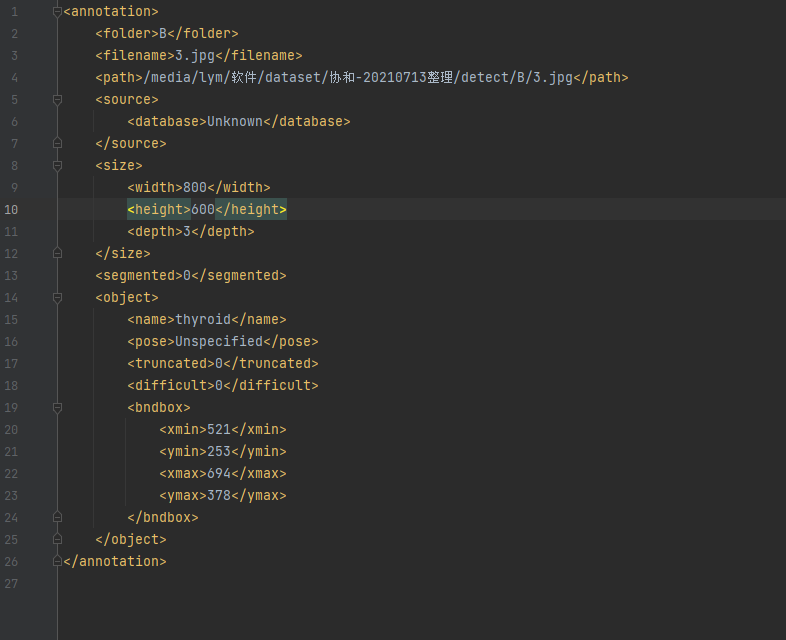

# 视频裁剪区域映射

###依赖包：
`pip install tqdm` \
`pip install opencv-python` 

----

⭐ 主要是依据造影对应的Pascal_VOC数据集标注格式的xml读取视频对应标注框位置，并映射至超声造影区域进行视频裁剪。 \
⭐ 循环利用cv2打开造影文件逐帧裁剪并按指定编码器 “XVID” 生成avi格式可自定时间（取0-30s）的视频数据。

  

---
### xml文件标注格式及文件夹内存储格式:
| xml文件标注格式                                | xml文件与视频文件存储格式                            |
|------------------------------------------|-------------------------------------------|
|   |  |

